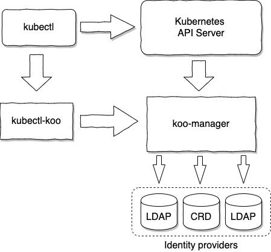

# KOOBIND

`Koobind` is a Kubernetes extension focused on user authentication.

It can authenticate users in a fully autonomous way, or can leverage one or several LDAP identity providers such as OpenLDAP or ActiveDirectory.

Beside handling LDAP, Koobind will also allow you to **manage users and groups as standard Kubernetes ressources**.

One main feature is its ability to **merge result from several identity providers**, thus allowing handling of users and groups defined at different level (Corporate, Departmental, Team, Cluster, ...)

Another main advantage is it **only require a ReadOnly access to the LDAP/AD server(s)**. User profile can then be enriched with local information.

## Index

- [Overview](#overview)
- [Installation](docs/installation.md)
- [Identity provider merging]
- [Token lifecycle](docs/tokenlifecycle.md)
- [Configuration reference]

## Overview

Technically, `Koobind` can be defined as:

- A token provider. Checking user's credential and delivering time limited tokens.
- A Kubernetes Authentication Webhook, allowing API Server to validate the token associated to each request.
- A kubectl plugin.
- A set of CRD (Custom Resources Definition), allowing definition of users and groups as standard Kubernetes resources.

This involves the following components:

 

- kubectl and Kubernetes API server are usual Kubernetes components.
- koocli is a kubectl plugin, providing a seamless user interaction.
- koo-manager is a pod running in Kubernetes and handling both requests from koocli and from the API Server. It also handle the logic to merge information from several Identity Providers.

Curently two kind of identity providers are supported:
- External LDAP server(s)
- CRD (Custom Resources Definition) based directory, stored in Kubernetes. 

