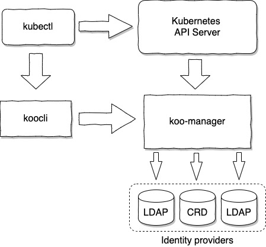

# KOOBIND

koobind is a Kubernetes extension focussed on user authentication.

It can authenticate users in a fully autonomous way, or can leverage one or several LDAP identity providers such as OpenLDAP or ActiveDirectory.

One main feature is its ability to merge result from several identity providers, thus allowing handling of users and groups defined at different level (Corporate, Departmental, Team, Cluster, ...)

Another main advantage is it only require a ReadOnly access to the LDAP/AD server(s). User profile can then be enriched with local information.

## Index

- [Overview](#overview)
- [Installation](docs/installation.md)
- [Identity provider merging]
- [Token lifecycle](docs/tokenlifecycle.md)
- [Configuration reference]

## Overview

Technically, Koobind can be defined as:

- A token provider. Checking user credential and delivering time limited tokens.
- A Kubernetes Authentication Webhook, allowing API Server to validate the token associated to each request.
- A kubectl plugin.
- A set of CRD (Custom Resources Definition), allowing definition of users and groups as standard Kubernetes resources.

This involves the following components:

 

- kubectl and Kubernetes API server are usual Kubernetes components.
- koocli is a kubectl plugin, providing a seamless user interaction.
- koo-manager is a pod running in Kubernetes and handling both requests from koocli and from the API Server. 

Here is a summary of the initial interaction:

- The user issue a kubectl command (i.e. `kubectl get nodes`).
- kubectl request a token to koocli.
- As koocli does not host any token for now, it will request the user to provide a login and a password.
- Then koocli request a token to koo-manager, based on the provided credential.
- koo-manager check the credential against one or several Identity provider and return a token.
- koocli store the token localy and return it to kubectl.
- kubectl now issue the request to the API Server, with the token as authentication header.
- The API Server check the token validity and retrieve associated user and group binding by calling koo-manager. 
- Based on RBAC, the API server allow or denied the initial request.

If the user issue another command in a short period, the locally stored token will be used.

More detailed information on [token lifecycle here](docs/tokenlifecycle.md)   

