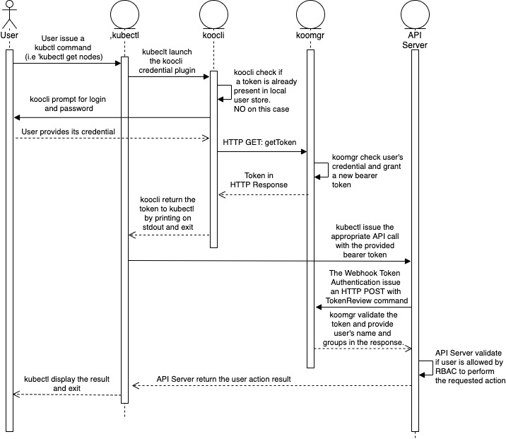
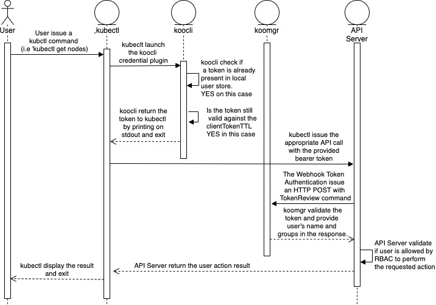
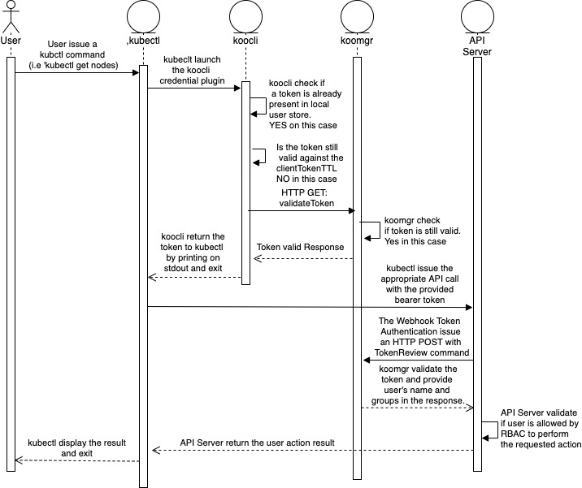
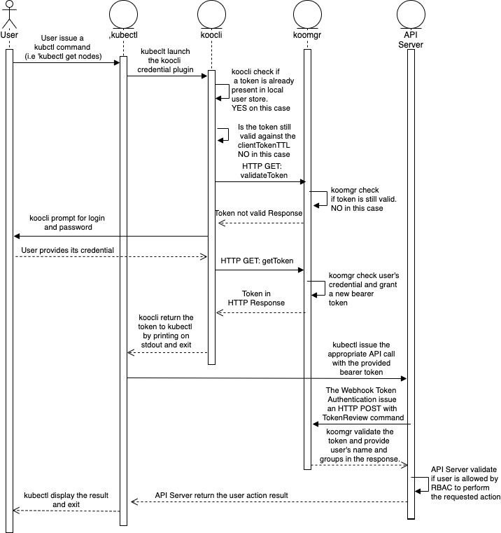

# Design

Here is a set of sequence diagrams describing interaction between `Koobind` and Kubernetes components: 

## Initial interaction.

## Token reuse from local cache

> The time logic of the system make sure if a token is still valid in the local client cache, it will be from the server standpoint (Except of course if the token has been deleted by external action)

## Token reuse

> When the kubectl call our kubectl-koo extension, we have no way to figure out if the call is due to a new command, or because the token we just provided before is expired. 
The is the reason why before returning a token to kubectl, we ensure it is still valid be issuing a `validateToken` API call to `koo-manager`.

## Token expired

