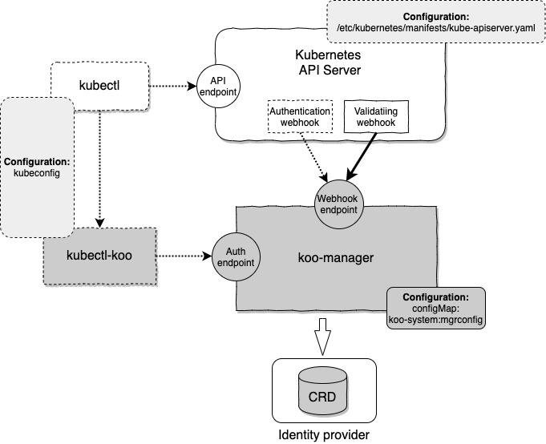

# Koobind installation

The process described here will install `Koobind` in a simple case, with only a first identity provider based on CRD.

Once this first step is completed, you will be able to easily add one (or several) LDAP/AD identity provider. 

> If Ansible is in your familiar toolset to manage your Kubernetes cluster, you may find an alternate installation process [here](./ansible.md)

Also, note this procedure has been developed on 'vanilla' Kubernetes cluster, build by [kubespray](https://github.com/kubernetes-sigs/kubespray). You may have to adapt it, depending of your configuration.

<!-- START doctoc generated TOC please keep comment here to allow auto update -->
<!-- DON'T EDIT THIS SECTION, INSTEAD RE-RUN doctoc TO UPDATE -->
**Index**

  - [Prerequisite](#prerequisite)
  - [Manifest deployment](#manifest-deployment)
  - [Endpoints and certificates](#endpoints-and-certificates)
    - [Fetch the Certificate Authority](#fetch-the-certificate-authority)
  - [API Server configuration](#api-server-configuration)
    - [Troubleshooting](#troubleshooting)
  - [kubectl plugin installation](#kubectl-plugin-installation)
  - [kubectl plugin configuration](#kubectl-plugin-configuration)
    - [Kubeconfig file location](#kubeconfig-file-location)
  - [Users creation](#users-creation)
  - [Installation validation](#installation-validation)
- [Admin configuration](#admin-configuration)

<!-- END doctoc generated TOC please keep comment here to allow auto update -->

## Prerequisite

To install `koobind`, you will need to have full admin rights on the target cluster. This means:

- An access with `kubectl` or equivalent using a fully privileged service account.
- Root access on nodes hosting the Kubernetes API server.

Also, `koobind` make use of [certificate manager](https://github.com/jetstack/cert-manager) to generate its certificate. Install it if not already present. 

## Manifest deployment

First step is to deploy some Kubernetes manifests:
 
```
$ kubectl apply -f https://github.com/koobind/koobind/releases/download/vX.X.X/crd.yaml
$ kubectl apply -f https://github.com/koobind/koobind/releases/download/vX.X.X/deploy.yaml
$ kubectl apply -f https://github.com/koobind/koobind/releases/download/vX.X.X/rbac.yaml
```
Where `vX.X.X` should be replaced by the one of the [release value](https://github.com/koobind/koobind/releases)

Then you will need to deploy the initial basic configuration (This is a configMap)

```
$ kubectl apply -f https://github.com/koobind/koobind/releases/download/vX.X.X/mgrconfig-basic.yaml
```

Note all deployment will occur inside the namespace `koo-system`

At this step, the koo-manager pod should be running:

```
$ kubectl -n koo-system get pods
NAME                           READY   STATUS    RESTARTS   AGE
koo-manager-568cc546d8-6drcq   1/1     Running   0          4m19s
```

> It may take some time to reach this state.

And the logs should not mention any errors:

```
$ kubectl -n koo-system logs koo-manager-XXXXXXX
{"level":"info","ts":1589127827.0832849,"logger":"providerChain","msg":"Setup provider","provider":"crdsys"}
{"level":"info","ts":1589127827.0833528,"logger":"setup","msg":"Namespaces","kubeClient":["koo-system"],"webhook":["koo-system"]}
{"level":"info","ts":1589127827.6812227,"logger":"controller-runtime.builder","msg":"Registering a mutating webhook","GVK":"directory.koobind.io/v1alpha1, Kind=User","path":"/mutate-directory-koobind-io-v1alpha1-user"}
...
{"level":"info","ts":1589127827.7838104,"logger":"auth.certwatcher","msg":"Starting certificate watcher"}
{"level":"info","ts":1589127827.7844315,"logger":"controller-runtime.webhook","msg":"serving webhook server","host":"","port":8443}
{"level":"info","ts":1589127827.7847195,"logger":"controller-runtime.certwatcher","msg":"Starting certificate watcher"}
{"level":"info","ts":1589127827.784754,"logger":"Auth server","msg":"serving Auth server","host":"","port":8444}
```

## Endpoints and certificates

Here is a more detailled overview of the `koobind` components (In grey): 

 

All dotted items are still to be installed at this stage.

As you can see, `koo-manager` offer two endpoints:

| Name           | Type    | FQDN                             |Target port|Service port| Access                                |
| -------------- | ------  | -------------------------------- | --------- | ---------- | ------------------------------------- |
|Webhook Endpoint|ClusterIP|koo-webhook-service.koo-system.svc|8443       |443         |From API Server. Internal to cluster   |
|Auth Endpoint   |NodePort |One or several Cluster nodes      |8444       |31444       |From `kubectl-koo`. External to cluster|

As these endpoints use HTTPS/SSL, a certificate must be provided. And this certificate must be issued by a CA (Certificate Authority) trusted by the clients.

This is  handled by the `certificate manager` kubernetes extension, which create a specific self-signed CA. Then a certificate is generated, used by both endpoints.

All this is defined by the `deploy.yaml` manifest.

> Of course, these are default choices, and could be adjusted for differents need, by providing an alternate `deploy.yaml`

But, there is a point here which need adjustement depending of your configuration: `kubectl-koo` will access the Auth endpoint by targeting one node of the cluster. 
So, the FQDN of this node must be included in the certificate.

Cut/Paste the following to create a manifest for this certificate definition:

```yaml
cat >./patchcert.yaml <<EOF
---
apiVersion: cert-manager.io/v1alpha2
kind: Certificate
metadata:
  name: koo-serving-cert
  namespace: koo-system
spec:
  dnsNames:
  - koo-webhook-service.koo-system.svc
  - koo-webhook-service.koo-system.svc.cluster.local
  issuerRef:
    kind: Issuer
    name: koo-selfsigned-issuer
  secretName: webhook-server-cert
EOF
```

> This definition is extracted from the `deploy.yaml` manifest.

Now edit this file by adding one or several entries in `dnsNames:`, corresponding to the FQDN of some of your cluster nodes:   

```yaml
---
apiVersion: cert-manager.io/v1alpha2
kind: Certificate
metadata:
  name: koo-serving-cert
  namespace: koo-system
spec:
  dnsNames:
  - koo-webhook-service.koo-system.svc
  - koo-webhook-service.koo-system.svc.cluster.local
  - node1.mycluster.mycompany.com
  - node1.mycluster
  - node1
  - node2.mycluster.mycompany.com
  - node2.mycluster
  - node2
  issuerRef:
    kind: Issuer
    name: koo-selfsigned-issuer
  secretName: webhook-server-cert
```

We suggest you provide several nodes, thus providing alternate choice when a node is down. You can also provide several alias for a node.

> A more sophisticated and robust deployment will use a load balancer in front of the Auth endpoint.

Then, you must apply your new certificate definition:

```
$ kubectl apply -f patchcert.yaml
```

If you look again to the logs of koo-manager, you should see some message about certificate update:

```
$ kubectl -n koo-system logs koo-manager-XXXXXXXXXXXXXXX
{"level":"info","ts":1589127827.0832849,"logger":"providerChain","msg":"Setup provider","provider":"crdsys"}
....
{"level":"info","ts":1589127827.7844315,"logger":"controller-runtime.webhook","msg":"serving webhook server","host":"","port":8443}
{"level":"info","ts":1589127827.7847195,"logger":"controller-runtime.certwatcher","msg":"Starting certificate watcher"}
{"level":"info","ts":1589127827.784754,"logger":"Auth server","msg":"serving Auth server","host":"","port":8444}
{"level":"info","ts":1589191649.853247,"logger":"auth.certwatcher","msg":"Updated current TLS certificate"}
{"level":"info","ts":1589191649.8533354,"logger":"controller-runtime.certwatcher","msg":"Updated current TLS certificate"}
{"level":"info","ts":1589191649.8539522,"logger":"auth.certwatcher","msg":"Updated current TLS certificate"}
{"level":"info","ts":1589191649.854047,"logger":"controller-runtime.certwatcher","msg":"Updated current TLS certificate"}
```

### Fetch the Certificate Authority

Now, you must retrieve the CA which issued this certificate, to provide it to client. 

This can be performed by issuing the following command:

```
$ kubectl -n koo-system get secret webhook-server-cert -o=jsonpath='{.data.ca\.crt}' | base64 -d >koomgr-ca.crt
```

The result should look like this:

```
$ cat koomgr-ca.crt
-----BEGIN CERTIFICATE-----
MIIDWTCCAkGgAwIBAgIQdBEXl09/Mbfie4u9ufhiwTANBgkqhkiG9w0BAQsFADAX
MRUwEwYDVQQKEwxjZXJ0LW1hbmFnZXIwHhcNMjAwNTExMTAwNzI5WhcNMjAwODA5
.....
.....
.....
V+oVL8dONYzrDqEWn/QW8lllNF8n0Ad3lqbWFjHdWAa0w3JVRxGZ4LWDF7REgwWN
n/901mrWtCEiMcSkReAmZrJ9S20kgDilKTA+24zkspzAubSu0OfH3I660/CK
-----END CERTIFICATE-----
```

## API Server configuration

As depicted on the previous schema, we must now configure the Authentication Webhook of the API server.

Must of the API Server Webhooks can be configured by deploying appropriate manifests. This is how our Validating webhook is setup, by `deploy.yaml`. 
But, unfortunatly, there is an exception for Authenticating Webhook, which must be deployed manually.

Depending of your installation, the directory mentioned below may differs. 
Also, this procedure assume the API Server is managed by the Kubelet, as a static Pod. If your API Server is managed by another system (i.e. systemd), you should adapt accordingly.

The following operations must be performed on all nodes hosting an instance of the Kubernetes API server. Typically, all nodes of the control plane.

Also, these operations require `root`access on these node.

First, create a folder dedicated to `Koobind`:

```
# mkdir -p /etc/kubernetes/koo
```

Then, create the Authentication webhook configuration file in this folder (You can cut/paste the following):

```
cat >/etc/kubernetes/koo/hookconfig.yaml <<EOF
apiVersion: v1
kind: Config
# clusters refers to the remote service.
clusters:
  - name: koomgr
    cluster:
      certificate-authority: /etc/kubernetes/koo/koomgr-ca.crt        # CA for verifying the remote service.
      server: https://koo-webhook-service.koo-system.svc:443/auth/v1/validateToken # URL of remote service to query. Must use 'https'.

# users refers to the API server's webhook configuration.
users:
  - name: kooapisrv

# kubeconfig files require a context. Provide one for the API server.
current-context: authwebhook
contexts:
- context:
    cluster: koomgr
    user: kooapisrv
  name: authwebhook
EOF
```

As you can see in this file, there is a reference to the CA file we fetch previously. So, you must copy this file to this location:

```
# ls -l /etc/kubernetes/koo
total 8
-rw-r--r--. 1 root root  620 May 11 12:36 hookconfig.yaml
-rw-r--r--. 1 root root 1220 May 11 12:58 koomgr-ca.crt
```

Now, you must edit the API server manifest file (`/etc/kubernetes/manifests/kube-apiserver.yaml`) to load the `hookconfig.yaml` file:

```
# vi /etc/kubernetes/manifests/kube-apiserver.yaml
```

First step is to add two flags to the kube-apiserver command line:

- `--authentication-token-webhook-cache-ttl`: How long to cache authentication decisions.
- `--authentication-token-webhook-config-file`: The path to the configuration file we just setup

Here is what it should look like: 

```
...
spec:
  containers:
  - command:
    - kube-apiserver
    - --authentication-token-webhook-cache-ttl=30s
    - --authentication-token-webhook-config-file=/etc/kubernetes/koo/hookconfig.yaml
    - --advertise-address=192.168.33.16
    - --allow-privileged=true
    - --anonymous-auth=True
...
```

And the second step will consists to map the node folder `/etc/kubernetes/koo` inside the API server pod, under the same path. 
This is required as these files are accessed in the API Server container context.

For this, a new `volumeMounts` entry should be added:

```
    volumeMounts:
    - mountPath: /etc/kubernetes/koo
      name: koo-config
    ....
```

And a corresponding new `volumes`  entry:

```
  volumes:
  - hostPath:
      path: /etc/kubernetes/koo
      type: ""
    name: koo-config
  ....
```

And another configuration parameter must be defined. The `dnsPolicy` must be set to `ClusterFirstWithHostNet`. Ensure such key does not already exists and add it:

```
  hostNetwork: true
  dnsPolicy: ClusterFirstWithHostNet 
```
 
This complete the API Server configuration. Saving the edited file will trigger a restart of the API Server.

For more information, the kubernetes documentation on this topic is [here](https://kubernetes.io/docs/reference/access-authn-authz/webhook/) 

### Troubleshooting

A small typo or incoherence in configuration may lead to API Server unable to restart. 
If this is the case, you may have a look in the logs of the Kubelet (Remember, as a static pod, the API Server is managed by the Kubelet) in order to figure out what'is happen.

If you made a modification in this the `hookconfig.yaml` file, or if you update the CA file, you may think you will need to restart the API Server to reload the configuration. 
Unfortunately, this may not be sufficient. API Server may restart with the old configuration. 

The only way to trigger an effective reload is to modify the `/etc/kubernetes/manifests/kube-apiserver.yaml` file. 
And you will need a real modification. Touch may not be enough. A common trick here is to modify slightly `the authentication-token-webhook-cache-ttl` flag value.

## kubectl plugin installation

Installation of the client part is quite simple. As a kubectl extension, the client executable must be in your path, with a specific naming 
convention: its name must begin by `kubectl-`. It will be `kubectl-koo` in our case.

Several client implementation are provided depending of your architecture. Below installation example is for Linux.

```
$ cd /tmp
$ wget https://github.com/koobind/koobind/releases/download/vX.X.X/koocli_X.X.X_Linux_x86_64.tar.gz
$ tar xvzf koocli_X.X.X_Linux_x86_64.tar.gz
$ sudo mv kubectl-koo /usr/local/bin
```

More information on this [here](https://kubernetes.io/docs/tasks/extend-kubectl/kubectl-plugins/)

## kubectl plugin configuration

As it will connect to the `koo-manager`, the client will need to access the CA file we fetched previously. Here, we will copy it in a dedicated location:

```
$ sudo mkdir -p /etc/koobind/certs
$ sudo cp .../koomgr-ca.crt  /etc/koobind/certs/
```

Then, the `kubeconfig` file must be created:

```
cat >/tmp/kubeconfig <<EOF
apiVersion: v1
clusters:
- cluster:
    certificate-authority-data: LS0tLS1CRUdJTiBDRVJU.......EUtLS0tLQo=   # <--- To copy from another kubeconfig
    server: https://192.168.33.39:6443                                   # <--- To copy from another kubeconfig
  name: mycluster.local
contexts:
- context:
    cluster: mycluster.local
    user: koo-user
  name: koo@mycluster.local
current-context: koo@mycluster.local
kind: Config
preferences: {}
users:
- name: koo-user
  user:
    exec: 
      apiVersion: "client.authentication.k8s.io/v1beta1"
      command: kubectl-koo
      args:
      - auth 
      - --server=https://node1.mycluster.mycompany.com:31444    # <---- Adjust FQDN to one of your node you included in the certificate
      - --rootCaFile=/etc/koobind/certs/koomgr-ca.crt           
EOF
sudo cp /tmp/kubeconfig /etc/koobind
```

In this file, three parts must be adjusted:

- `cluster.certificate-authority-data` and `cluster.server` values must be cut/pasted from another kubeconfig file targeting your cluster
- `--server=` url must be adjusted to target one of the node of the cluster among the ones provided in the certificate.

So:

```
$ sudo vi /etc/koobind/kubeconfig
```

to edit it.

### Kubeconfig file location

Note this kubeconfig file is generic. It does not host any user information. As such, it can be shared by all users of an administration node.

For this, each user will need to set its environment with the following variable;

```
export KUBECONFIG=/etc/koobind/kubeconfig
```

This may be set in a shared init file, such as `/etc/bashrc` or `/etc/profile`.

As an alternate solution, this `kubeconfig` file can be put in the default, user specific location: `~/.kube/config`. This, of course for each users.

```
$ cp /etc/koobind/kubeconfig ~/.kube/config
```

## Users creation

Now, we can create a first user to test all the authentication chain. With `Koobind`, Users and Groups are Kubernetes resources as many others. Thus can easily be created by applying manifests. 

A sample `admin` user manifest is provided. Here is its content:

```
---
apiVersion: directory.koobind.io/v1alpha1
kind: User
metadata:
  name: admin
  namespace: koo-system
spec:
  commonName: Koo ADMIN
  passwordHash: $2a$10$rRL5Tfm5YHLv/d/vDu3bDO8eb92LZAkCqr5Try77R04PGhFfKO0rS  # admin
```

The password is provided as a Hash. Sample value is 'admin' (`Koobind` provide a tool to generate such hash. See [here](usage.md)).

But, to apply this manifest, you will need to have full access on the cluster.

> We will assume here that the defaut `~/.kubi/config` file provide full cluster admin access.

So, if you have set the KUBECONFIG env variable as described previously, clear it.

```
$ export KUBECONFIG=
$ kubectl apply -f https://raw.githubusercontent.com/koobind/koobind/master/samples/admin.yaml
user.directory.koobind.io/admin created

# And check it has been crated
$ kubectl -n koo-system get user
NAME    COMMON NAME   EMAIL   UID   COMMENT   DISABLED
admin   Koo ADMIN
```

## Installation validation

Now, you can try to log with the `Koobind` authentication mechanism:

```
$ export KUBECONFIG=/etc/koobind/kubeconfig
$ kubectl get nodes
Login:admin
Password:
logged successfully..
Error from server (Forbidden): nodes is forbidden: User "admin" cannot list resource "nodes" in API group "" at the cluster scope
```

> Remember: Password is 'admin'. See the [usage](usage.md) section to change it.

If you got such message, everything is ok. Authentication was successful. Of course, create a user does not grant it any rights, so the error message. 

Beside handling authentication, the `koobind` plugin provide several subcommands, which can be accessed by the `koo` prefix. For example:  

```
$ export KUBECONFIG=/etc/koobind/kubeconfig
$ kubectl koo whoami
user:admin  id:  groups:
```

Description of these subcommands can be found [here](usage.md)

# Admin configuration

But currently this user, despite his name, can't administrate anything, as there is no role associated.

Another sample manifest will:

- Create a Group `kooadmin`.
- Bind this Group to the role `koo-directory-editor`. This role was defined by the `rbac.yaml` manifest we installed at the beginning 
of this procedure and allow full access to the `directory.koobind.io` API Group in the namespace `koo-system`.
- Bind this Group to the role `koo-token-editor`. This role was defined by the `rbac.yaml` manifest we installed at the beginning 
of this procedure and allow full access to the `token.koobind.io` API Group in the namespace `koo-system`.
- Include the user `admin` the the group `kooadmin`.

```
$ export KUBECONFIG=
$ kubectl apply -f https://raw.githubusercontent.com/koobind/koobind/master/samples/kooadmin.yaml
group.directory.koobind.io/kooadmin created
rolebinding.rbac.authorization.k8s.io/koo-directory-editor-kooadmin created
rolebinding.rbac.authorization.k8s.io/koo-token-editor-kooadmin created
groupbinding.directory.koobind.io/admin-kooadmin created
```

Of course, one must logout for the new mapping to be effective

```
$ export KUBECONFIG=/etc/koobind/kubeconfig
$ kubectl koo logout
Bye!
```

> `logout` is another Koobind subcommand

Admin user can now access all resources in the `koo-system` namespace:

```
$ kubectl -n koo-system get user
Login:admin
Password:
logged successfully..
NAME    COMMON NAME   EMAIL   UID   COMMENT   DISABLED
admin   Koo ADMIN

$ kubectl -n koo-system get groupbinding
NAME             USER    GROUP      DISABLED
admin-kooadmin   admin   kooadmin

$ kubectl -n koo-system get group
NAME       DESCRIPTION                   DISABLED
kooadmin   Koobind administrator group
```

But our `admin` user perimeter is still limited to `Koobind` resources: 

```
$ kubectl get pods --all-namespaces
Error from server (Forbidden): pods is forbidden: User "admin" cannot list resource "pods" in API group "" at the cluster scope
```

To make it a full, cluster wide, administrator, with all privileges, you can apply the following manifest:
 
```
$ export KUBECONFIG=
$ kubectl apply -f https://raw.githubusercontent.com/koobind/koobind/master/samples/clusteradmin.yaml
group.directory.koobind.io/clusteradmin created
groupbinding.directory.koobind.io/admin-clusteradmin created
clusterrolebinding.rbac.authorization.k8s.io/clusteradmin created
```

This will:

- Create the group `clusteradmin`
- Associate the ClusterRole `cluster-admin` to this Group.
- Include our User `admin` to this Group.

> The `cluster-admin` ClusterRole was defined at the cluster creation in our case. May be, depending of your configuration, you will need to adapt this.

Now, our `admin` user should be able to do everything on this cluster:

```
$ export KUBECONFIG=/etc/koobind/kubeconfig
$ kubectl koo logout
Bye!
$ kubectl get pods --all-namespaces
Login:admin
Password:
logged successfully..
NAMESPACE        NAME                                       READY   STATUS    RESTARTS   AGE
cert-manager     cert-manager-6f578f4565-n5k8l              1/1     Running   9          55d
cert-manager     cert-manager-cainjector-75b6bc7b8b-rfsvn   1/1     Running   24         18d
cert-manager     cert-manager-webhook-8444c4bc77-c62sv      1/1     Running   7          55d
koo-system       koo-manager-568cc546d8-6drcq               1/1     Running   0          3d16h
kube-system      calico-kube-controllers-db4bb4bd8-flp87    1/1     Running   7          55d
kube-system      calico-node-7pm4n                          1/1     Running   7          55d
kube-system      coredns-58687784f9-cn7jw                   1/1     Running   7          55d
kube-system      kube-apiserver-kspray1                     1/1     Running   0          36h
....
```

Installation is now completed. You can now move on [usage](usage.md) of `Koobind`...

