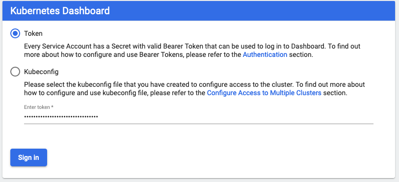
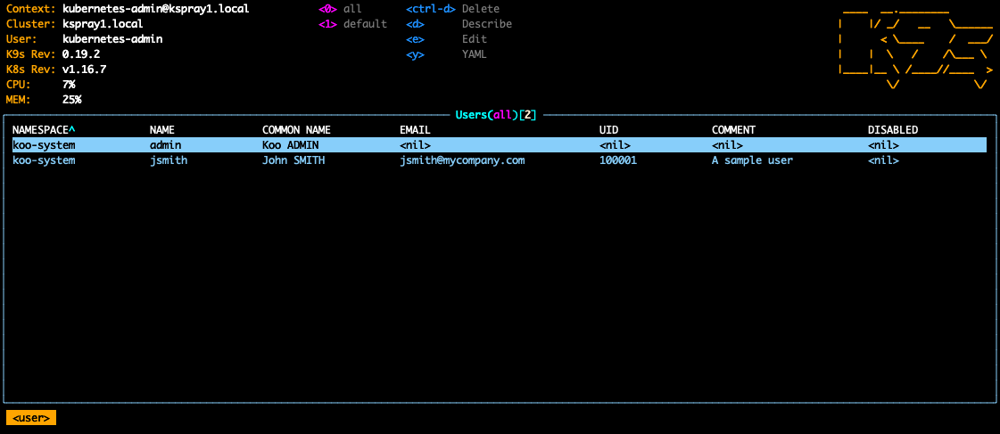
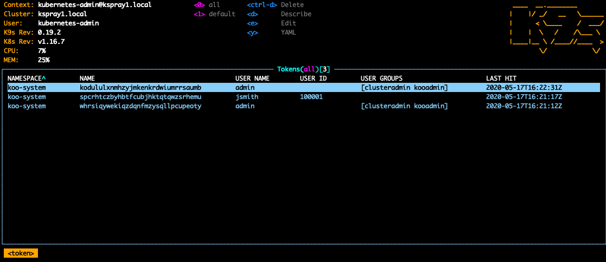
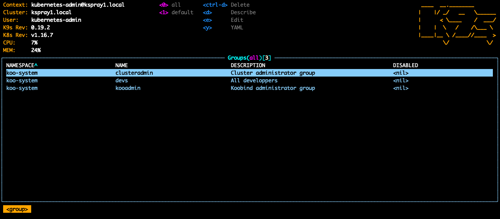
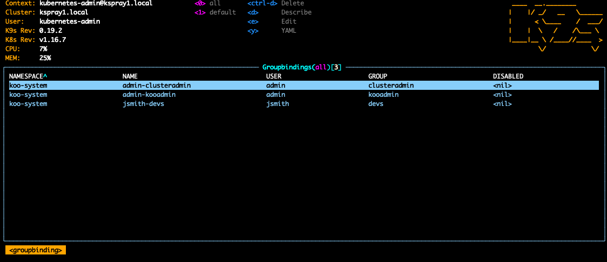

# Koobind usage


<!-- START doctoc generated TOC please keep comment here to allow auto update -->
<!-- DON'T EDIT THIS SECTION, INSTEAD RE-RUN doctoc TO UPDATE -->
**Index**

- [User and Group resources](#user-and-group-resources)
  - [User](#user)
  - [Group](#group)
  - [GroupBinding](#groupbinding)
- [Login / Logout](#login--logout)
- [User and Group CLI management](#user-and-group-cli-management)
  - [Create and delete user](#create-and-delete-user)
  - [Patch user](#patch-user)
  - [Apply to user](#apply-to-user)
  - [Groups management](#groups-management)
  - [Group binding](#group-binding)
  - [Disabled flag](#disabled-flag)
- [Tokens](#tokens)
- [Context](#context)
  - [Context store](#context-store)
  - [--kubeconfig option](#--kubeconfig-option)
- [Kubernetes Dashboard](#kubernetes-dashboard)
- [k9s](#k9s)

<!-- END doctoc generated TOC please keep comment here to allow auto update -->


## User and Group resources

If you have followed up the full installation process, you can now create and manage Kubernetes users and groups as resources.

Here is a sample you can apply as is:

```
$ export KUBECONFIG=/etc/koobind/kubeconfig
$ kubectl apply -f https://raw.githubusercontent.com/koobind/koobind/master/samples/users.yaml
Login:admin
Password:
logged successfully..
user.directory.koobind.io/jsmith created
group.directory.koobind.io/devs created
groupbinding.directory.koobind.io/jsmith-devs created
```

Of course, you will need to be allowed to create resources in the `koo-system` namespace. This is the case of the 'admin' user we created during installation procedure. We will use it in this chapter.

### User

Here is the User definition with all attributes:

```
---
apiVersion: directory.koobind.io/v1alpha1
kind: User
metadata:
  name: jsmith
  namespace: koo-system
spec:
  commonName: John SMITH
  passwordHash: $2a$10$qumINdiGJIM1si2wi8ceDOczChq2twfDEDa6DR7jiYL8rJNzeYtmu
  email: jsmith@mycompany.com
  uid: 100001
  comment: A sample user
  disabled: no
```

> The password matching this hash is `smithj`.

- The user login is the `metadata.name` field value.
- All `spec.*` attribute are optionals.
- Namespace must be `koo-system` (This is not 'hard coded'. See [configuration reference](configuration.md))
- `spec.commonName`, `spec.email`, `spec.uid` and `spec.comment` attributes are for user description, and have no impact on the way this user is handled by `Koobind` and Kubernetes.
- Setting `spec.disabled` to `True` would make this user unable to login.

The only way to define a password it to provide a 'hash'. To generate such appropriate value, a sub-command `kubectl koo hash` is provided:

```
$ export KUBECONFIG=/etc/koobind/kubeconfig
$ kubectl koo hash
Password:
Confirm password:
$2a$10$6B93pPYM5EqejYV2MDCOAuEgJCfXfNysTdTvTCUGc.ON0gEVEY6Q.
```

Also, note the `spec.passwordHash` field is optional. What is interest of a user without password ? 
One answer is when combining several identity providers, user identification can be provided by another one and this definition may populate this user with more attribute and GroupBinding.

### Group

Here is the Group definition with all attributes:

```
---
apiVersion: directory.koobind.io/v1alpha1
kind: Group
metadata:
  name: devs
  namespace: koo-system
spec:
  description: All developpers
  disabled: no
```

- All `spec.*` attribute are optionals.
- Namespace must be `koo-system`.
- `spec.description` attribute is for documentation and have no impact on the way this group is handled by `Koobind` and Kubernetes.
- Setting `spec.disabled` to `True` would make this group not existing. It will not be reported on any user's group list. 

### GroupBinding

Here is the GroupBinding definition with all attributes:

```
---
apiVersion: directory.koobind.io/v1alpha1
kind: GroupBinding
metadata:
  name: jsmith-devs
  namespace: koo-system
spec:
  user: jsmith
  group: devs
  disabled: no

```

- `spec.user` and `spec.group` attribute are mandatory.
- Namespace must be `koo-system`.
- Setting `spec.disabled` to `True` would make this binding transparent. It will not contribute to any user's group list.  

### List our resources 

As Users and groups are Kubernetes resources, we can list them:

```
$ kubectl -n koo-system get users
NAME     COMMON NAME   EMAIL                  UID      COMMENT         DISABLED
admin    Koo ADMIN
jsmith   John SMITH    jsmith@mycompany.com   100001   A sample user

$ kubectl -n koo-system get groups
NAME           DESCRIPTION                   DISABLED
clusteradmin   Cluster administrator group
devs           All developpers               false
kooadmin       Koobind administrator group

$ kubectl -n koo-system get groupbindings
NAME                 USER     GROUP          DISABLED
admin-clusteradmin   admin    clusteradmin
admin-kooadmin       admin    kooadmin
jsmith-devs          jsmith   devs           false
```

Provided of course we are still logged as 'admin'.

## Login / Logout

Now, if we want to test this new user, we need to logout first. For this, there is the `koo logout` subcommand;

```
$ kubectl koo logout
Bye!
```

Now, we can try our new user:

```
$ kubectl -n koo-system get users
Login:jsmith
Password:
logged successfully..
Error from server (Forbidden): users.directory.koobind.io is forbidden: User "jsmith" cannot list resource "users" in API group "directory.koobind.io" in the namespace "koo-system"
```

> Remember: Password is `smithj`.

Of course, this user is not allowed to perform the requested operation. But we can check the authentication is successful by using the `koo whoami` subcommand:

```
$ kubectl koo whoami
USER     ID       GROUPS
jsmith   100001   devs
```

An alternate solution is to explicitly login using the `koo login` subcommand:

```
kubectl koo login
Login:jsmith
Password:
logged successfully..

$ kubectl koo whoami
USER     ID       GROUPS
jsmith   100001   devs
```

(If a user was previously logged, a logout is performed by the `koo login` subcommand)

One can also provide credential on the command line:

```
$ kubectl koo login --user jsmith
Password:
logged successfully..

$ kubectl koo whoami
USER     ID       GROUPS
jsmith   100001   devs
```

or:

```
$ kubectl koo login --user jsmith --password smithj
logged successfully..

$ kubectl koo whoami
USER     ID       GROUPS
jsmith   100001   devs
```

> Of course, providing the password in clear text such this way is a huge security issue. Use it as your own risk. 

`Koobind` provide also a command allowing a user to change its password:

```
$ kubectl koo password
Old password:
New password:
Confirm new password:
Password changed successfully.
```

Or, the non-interactive, risky version:

```
$ kubectl koo password --oldPassword jsmith --newPassword utemlmhdt$3
```

## User and Group CLI management

As we saw, `koobind` allow you to manage your users and groups as standard Kubernetes resources. 

Beside this, it also provides a Command Line Interface to handle theses ressources  

### Create and delete user

For example, to create a user:

```
$ kubectl koo create user pjohnson
User created successfully.
```

> Of course, you must be logged as an 'admin' user, member of the 'kooadmin' group. 

We created a user, but without any attribute (and without password).

```
$ kubectl -n koo-system get users
NAME       COMMON NAME   EMAIL                  UID      COMMENT         DISABLED
....
pjohnson
....
```

So, we can delete it:

```
$ kubectl koo delete user pjohnson
User deleted successfully.
```

And recreate it, now with all attributes, including a password, as hashed value:

```
$ kubectl koo hash
Password:
Confirm password:
$2a$10$3eW8SER9XKDPtcdyAj74t.H2/1luh.6pjOvYqIYrhr1.svqPcpOx.

$ kubectl koo create user pjohnson --comment "P. Johnson" --commonName "Paul JOHNSON" --email "pjohnson@mycompany.com" --uid 2001 --passwordHash '$2a$10$3eW8SER9XKDPtcdyAj74t.H2/1luh.6pjOvYqIYrhr1.svqPcpOx.'
```

> Note the simple quote to protect the password from shell variable extension.


We have now a fully populated user:

```
$ kubectl -n koo-system get users
NAME       COMMON NAME    EMAIL                    UID      COMMENT         DISABLED
....
pjohnson   Paul JOHNSON   pjohnson@mycompany.com   2001     P. Johnson
....
```

> The `disabled` flag and option will be explained later in this chapter. 

Of course, having to cut and paste the hash value can be tedious. So, if we are not afraid to display the password, this can be achieved in one line:

```
$ kubectl koo create user pjohnson --comment "P. Johnson" --commonName "Paul JOHNSON" --email "pjohnson@mycompany.com" --uid 2001 --passwordHash $(kubectl koo hash --password 'changeme')
User created successfully.
```

### Patch user

Now, what if we just want to change one parameter of the user. We have the `patch` subcommand for this:

```
$ kubectl koo patch user pjohnson --email "paul.johnson@mycompany.com"
User updated successfully.
$ kubectl -n koo-system get users
NAME       COMMON NAME    EMAIL                        UID      COMMENT         DISABLED
....
pjohnson   Paul JOHNSON   paul.johnson@mycompany.com   2001     P. Johnson
....
```

Only the email has been changed. Changing the user's password is also possible: 

```
kubectl koo patch user pjohnson --passwordHash $(kubectl koo hash --password 'changemeagain')
User updated successfully.
```

The `patch` subcommand assumes the user already exists. Otherwise, it will return an error.

### Apply to user

The `apply` subcommand create the user if it does not exist and adjust all parameters to the provided values. This also means all parameters not provided will be set to empty value.

```
$ kubectl koo apply user ajohnson --commonName "Alan JOHNSON" --passwordHash $(kubectl koo hash --password 'changeme')
User created successfully.

$ kubectl -n koo-system get users
NAME       COMMON NAME    EMAIL                        UID      COMMENT         DISABLED
....
ajohnson   Alan JOHNSON
....
```

For example, setting only email will reset all others parameters.

```
$ kubectl koo apply user ajohnson --email "a.johnson@mycompany.com"
User updated successfully.

$ kubectl -n koo-system get users
NAME       COMMON NAME    EMAIL                        UID      COMMENT         DISABLED
....
ajohnson                  a.johnson@mycompany.com
....
```

`commonName` and `password` hash been reset.

This ensures the user state is fully described by the `apply` sub commands, whatever state it was before.

> The `apply` subcommand is idempotent.

### Groups management

We have the same set of commands for the koobind `group` entity. Beside its name, a group have only a `description` attribute. (And a `disabled` flag as described below)

```
$ kubectl koo create group johnsonbrothers --description "The Johnson brothers team"
Group created successfully.

$ kubectl koo patch  group johnsonbrothers --description "The Johnson family"
Group updated successfully.

$ kubectl -n koo-system get groups
NAME              DESCRIPTION                   DISABLED
....
johnsonbrothers   The Johnson family
....

$ kubectl koo apply  group johnsonbrothers --description ""
Group updated successfully.

$ kubectl -n koo-system get groups
NAME              DESCRIPTION                   DISABLED
....
johnsonbrothers  
....
```

### Group binding

And, there is also the same set of command for the third kind of resources: the `groupbinding`

```
$ kubectl koo create groupbinding pjohnson johnsonbrothers
GroupBinding created successfully.

$ kubectl -n koo-system get groupbinding
NAME                       USER       GROUP             DISABLED
....
ajohnson-johnsonbrothers   ajohnson   johnsonbrothers
....
pjohnson-johnsonbrothers   pjohnson   johnsonbrothers
....

$ kubectl koo delete groupbinding pjohnson johnsonbrothers
GroupBinding deleted successfully.

$ kubectl koo apply groupbinding pjohnson johnsonbrothers
GroupBinding created successfully.
$ kubectl koo apply groupbinding pjohnson johnsonbrothers
GroupBinding updated successfully.
```

Note this command needs two parameters: The user, then the group.

### Disabled flag

Each of these resources have a `disabled` flag. The meaning of this flag is obvious. If set, the system behave as if this resource was not existing.

For technical reason, internally, this flag has three state: Unset (nil), true, false. Unset is interpreted as false.

For each corresponding koo subcommands, there are two options: `--disabled` and `--enabled`. These options behave differently, depending of the command:

- For `create` and `apply` subcommand, not providing `--disabled` or `--enabled` option means this flag will be unset (equivalent to false). 
So, setting `--enabled` or no flag leads the same result. 

- For `patch` subcommand, not providing `--disabled` or `--enabled` flag means leave the current value unchanged. To change the value, this option must be provided accordingly.

## Tokens

All kubernetes authentication system is based on 'bearer tokens'. Token are provided by the user on each request (either explicitly, or implicitly, in our case by the `kubctl-koo client`).
Then the kubernetes apiserver validate this token against some authentication backend. `koo-manager` in our case.

A token can host some information. This is the case of JWT token, where the user name and groups are encoded in the token itself. 
Or it can be a meaningless random string, which act as a key in the backend to retrieve user information. This is the way it is for `koobind`.

Another aspect about token is time to live. `Koobind` implements two time limits for a token:

- An absolute token duration (Default: 24 H)
- An inactivity time out (Default: 30 m). If a token is not used during this period, it will expire.

The last mechanism is similar to the usual cookie based session logic used for most Web applications.
 
One can display the active tokens using the `koo get tokens` subcommand:

```
$ kubectl koo get tokens
TOKEN                              USER     UID      GROUPS                  CREATED ON       LAST HIT
uzvbzgjrhoqzdqzpjxomamrxqopdedba   admin             clusteradmin,kooadmin   05-17 11:09:04   11:09:04
boqpsyrvhxjlimkusvacuvdyvxyqmphc   jsmith   100001   devs                    05-17 11:09:34   11:09:34
jtaoyzandgoxmsnnybwkfseqbztpfmtg   admin             clusteradmin,kooadmin   05-17 11:09:51   11:10:26
```

Of course, you must be member of the 'kooadmin' group. If not:

```
$ kubectl koo get tokens
ERROR: You are not allowed to perform this operation!
```

Token themself are stored as Kubernetes resources. So we can also display them using standard kubectl commands: 

```
$ kubectl -n koo-system get tokens
NAME                               USER NAME   USER ID   USER GROUPS               LAST HIT
boqpsyrvhxjlimkusvacuvdyvxyqmphc   jsmith      100001    [devs]                    2020-05-17T11:09:34Z
jtaoyzandgoxmsnnybwkfseqbztpfmtg   admin                 [clusteradmin kooadmin]   2020-05-17T11:13:17Z
uzvbzgjrhoqzdqzpjxomamrxqopdedba   admin                 [clusteradmin kooadmin]   2020-05-17T11:09:04Z
```

As tokens represents active sessions, it could be useful to be able to cancel them:

```
$ kubectl koo cancel token boqpsyrvhxjlimkusvacuvdyvxyqmphc
Token boqpsyrvhxjlimkusvacuvdyvxyqmphc is successfully cancelled
 
$ kubectl koo get tokens
 TOKEN                              USER    UID   GROUPS                  CREATED ON       LAST HIT
 uzvbzgjrhoqzdqzpjxomamrxqopdedba   admin         clusteradmin,kooadmin   05-17 11:09:04   11:09:04
 jtaoyzandgoxmsnnybwkfseqbztpfmtg   admin         clusteradmin,kooadmin   05-17 11:09:51   11:15:04
```

Now, the user `jsmith` will have to log again. (This operation can be required if you modify some user's attribute and want it to be activated immediately.)

## Context

When testing authentication/authorization rules, switching back and forth to different users by logout/login can quickly be painful.

To avoid this, we can make use of the context mechanisms build in the 'kubeconfig' file. One solution could be to make two different kubeconfig files. 
If your client configuration has been deployed as described in the [installation](installation.md) section, duplicate the kubeconfig file and edit each version to have a different context name:  

```
$ cd /etc/koobind
$ sudo cp kubeconfig kubeconfig1
$ sudo cp kubeconfig kubeconfig2
$ sudo vi kubeconfig1

....
- context:
    cluster: mycluster.local
    user: koo-user
  name: koo1@mycluster.local
current-context: koo1@mycluster.local
....

$ sudo vi kubeconfig2

....
- context:
    cluster: mycluster.local
    user: koo-user
  name: koo2@mycluster.local
current-context: koo2@mycluster.local
....
```

Then, you can open two terminals and set appropriate value in KUBECONFIG environment variable:

- On terminal1

```
$ export KUBECONFIG=/etc/koobind/kubeconfig1
$ kubectl -n koo-system get users
Login:admin
Password:
logged successfully..
NAME     COMMON NAME   EMAIL                  UID      COMMENT         DISABLED
admin    Koo ADMIN
jsmith   John SMITH    jsmith@mycompany.com   100001   A sample user

$ kubectl koo whoami
USER    ID   GROUPS
admin        clusteradmin,kooadmin
```

- On terminal 2

```
export KUBECONFIG=/etc/koobind/kubeconfig2
$ kubectl -n koo-system get users
Login:jsmith
Password:
logged successfully..
Error from server (Forbidden): users.directory.koobind.io is forbidden: User "jsmith" cannot list resource "users" in API group "directory.koobind.io" in the namespace "koo-system"

$ kubectl koo whoami
USER     ID       GROUPS
jsmith   100001   devs
```

If you switch back and forth between the two terminals, you can check each session is isolated.

> An alternate solution would be to create a single kubeconfig file with several context inside. 
Then, you will be able to switch between with the command `kubectl config use-context <newContext>`.

### Context store

The `kubectl-koo` client active tokens are stored locally in the folder `~/.kube/cache/koo/<contextName>/`. 

A `koo get context` subcommand will allow to display the different context used. With the active one spotted by a `*`.

``` 
$ kubectl koo get context
    CONTEXT                SERVER                  CA
    koo1@mycluster.local   https://kspray1:31444   /etc/koobind/certs/koomgr_ca.crt
*   koo2@mycluster.local   https://kspray1:31444   /etc/koobind/certs/koomgr_ca.crt
    koo@mycluster.local    https://kspray1:31444   /etc/koobind/certs/koomgr_ca.crt
```

### --kubeconfig option

Another solution to switch between context is to provide the `--kubeconfig` option on the command line. For this to works:

- For all `koo ...` subcommands, this option must be provided after the `koo ...` subcommand:

```
$ kubectl koo logout --kubeconfig=/etc/koobind/kubeconfig1 
```

- A `context` parameter with the relevant context name must be provided to the command in the 'kubeconfig' files:

```
$ sudo vi kubeconfig1

....
- context:
    cluster: mycluster.local
    user: koo-user
  name: koo1@mycluster.local
current-context: koo1@mycluster.local
kind: Config
preferences: {}
users:
- name: koo-user
  user:
    exec:
      apiVersion: "client.authentication.k8s.io/v1beta1"
      command: kubectl-koo
      args:
      - auth
      - --server=https://kspray1:31444    # <---- Adjust FQDN to one of your node you included in the certificate
      - --rootCaFile=/etc/koobind/certs/koomgr_ca.crt
      - --context=koo1@mycluster.local
```

The value of this `context` parameter **must match** the `current-context`

## Kubernetes Dashboard

Login to the Kubernetes dashboard with `koobind` is quite easy.

First, you must be logged using the CLI. Then using the `--token` option of the `koo whoami` command, you can get your current allocated token:  

```
$ kubectl koo login
Login:admin
Password:
logged successfully..

$ kubectl koo whoami --token
USER    ID   GROUPS                  TOKEN
admin        clusteradmin,kooadmin   majwzilcacwkrsuzrnfbzyuvywltsuxo
```

Now, you just have to cut and paste the token value in the dashboard login screen:



Of course, the set of operation you will be able to perform through the dashboard will be limited by the logged user's permissions.

## k9s

To conclude this chapter, we would like to say two words about this great tool which is [k9s](https://github.com/derailed/k9s) 

As it is able to handle Custom Resources Definition out of the box, K9s is a perfect tool to dynamically display, modify or delete `koobind` resources.
 
Note than, as User and Group are ambiguous names, which are used also by others API, alias are provided to ensure ambiguous access.
 
For example, you can access this screen under `koouser` resource name:
  


This one using `kootoken`:



This one using `koogroup`:



This one using `koogroupbinding`:



Of course, k9s can't do more than what the launching user is allowed to do. This user can be authenticated using `koobind`, but it must have a minimum set of rights to behave correctly. 

For example, you can launch k9s under the `admin` user account we have set up in the installation process.

```
$ kubectl koo login --user admin
Password:
logged successfully..
$ k9s
....
```

